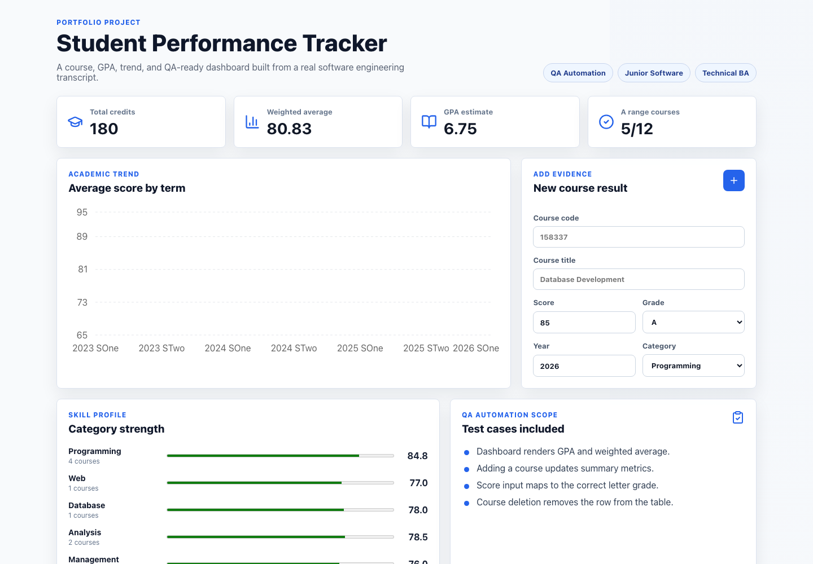

# Student Performance Tracker

A React and TypeScript portfolio project for tracking course results, estimating GPA,
visualizing academic trends, and validating core user flows with Playwright end-to-end tests.

[Live Demo](https://zzs77a.github.io/student-performance-tracker/) ·
[Repository](https://github.com/zzs77a/student-performance-tracker)



## Why This Project

This project was built as a job-search portfolio piece for software-adjacent graduate roles:

- QA Automation Engineer
- Junior Software Developer
- Technical Business Analyst
- IT Business Analyst

It uses real software engineering course data as the domain model and turns it into a working dashboard with measurable business-style outputs: GPA estimate, weighted average, academic trend, category profile, and tested CRUD behavior.

## Features

- Course record table based on transcript-style software engineering data.
- Weighted average and GPA estimate calculations.
- Academic trend chart by semester.
- Skill profile by course category.
- Add and delete course records from the UI.
- Score-to-grade mapping for new course entries.
- Automated Playwright tests for critical user journeys.
- GitHub Pages deployment through GitHub Actions.

## Tech Stack

| Area | Tools |
| --- | --- |
| Frontend | React, TypeScript, Vite |
| Data visualization | Recharts |
| UI icons | Lucide React |
| Testing | Playwright |
| Deployment | GitHub Actions, GitHub Pages |

## QA Automation Coverage

The Playwright test suite covers:

- Dashboard rendering and summary metrics.
- Adding a new course record.
- Score-to-grade mapping.
- Deleting a course record.

Run tests locally:

```bash
npm run test:e2e
```

Current validation:

```text
npm run build      passing
npm run lint       passing
npm run test:e2e   4 passed
```

## Resume Project Description

**Student Performance Tracker**  
Built a React and TypeScript dashboard to manage course records, calculate GPA, visualize academic trends, and validate core user flows with Playwright automated tests.

**Tech:** React, TypeScript, Vite, Recharts, Playwright, GitHub Actions

**Highlights:**

- Implemented course CRUD, weighted average calculation, GPA estimation, and semester trend visualization.
- Built Playwright end-to-end tests covering dashboard rendering, course creation, grade mapping, and deletion.
- Deployed the application to GitHub Pages using an automated GitHub Actions workflow.
- Structured the project as a portfolio artifact for QA Automation, Junior Developer, and Technical Business Analyst roles.

## Technical Business Analyst Angle

This project can also be discussed as a small business analysis case:

- Defined course records, grades, categories, and summary metrics as the application domain model.
- Turned transcript-style data into decision-support indicators.
- Included validation scenarios that map directly to user acceptance criteria.
- Presented the product with a dashboard layout suitable for non-technical users.

## Run Locally

```bash
npm install
npm run dev
```

Open:

```text
http://127.0.0.1:5173
```

## Build

```bash
npm run build
```

## Deployment

The project is deployed with GitHub Pages:

```text
https://zzs77a.github.io/student-performance-tracker/
```

Every push to `main` triggers the deployment workflow in `.github/workflows/deploy.yml`.
